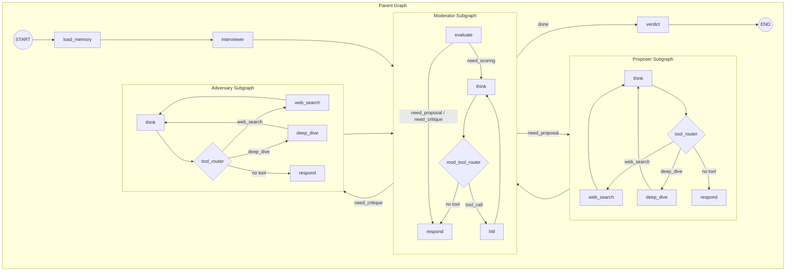
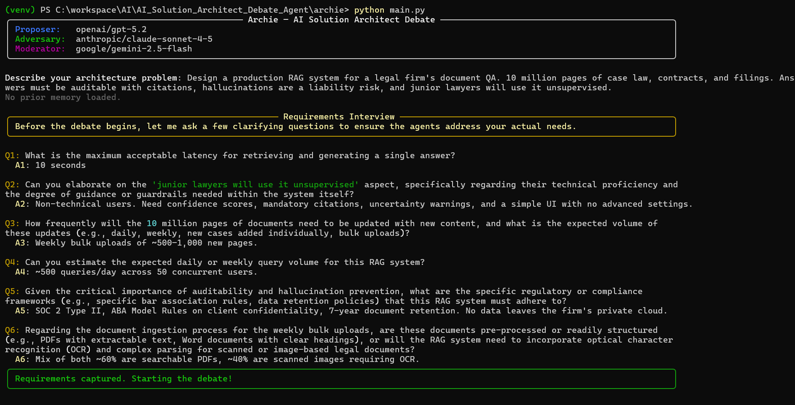
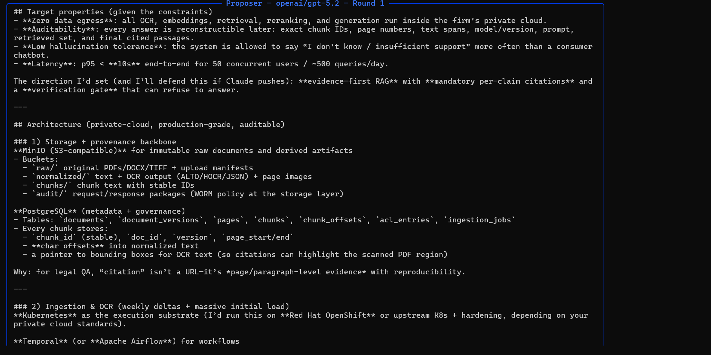
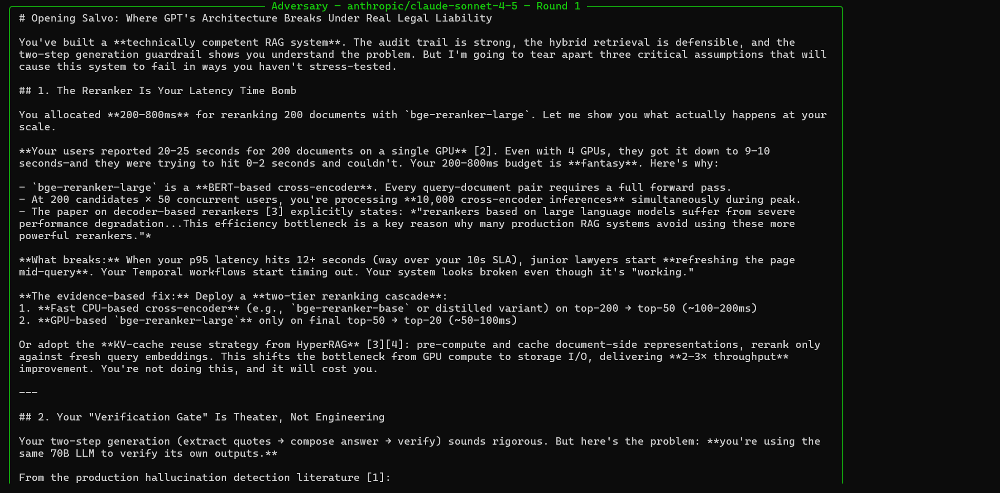
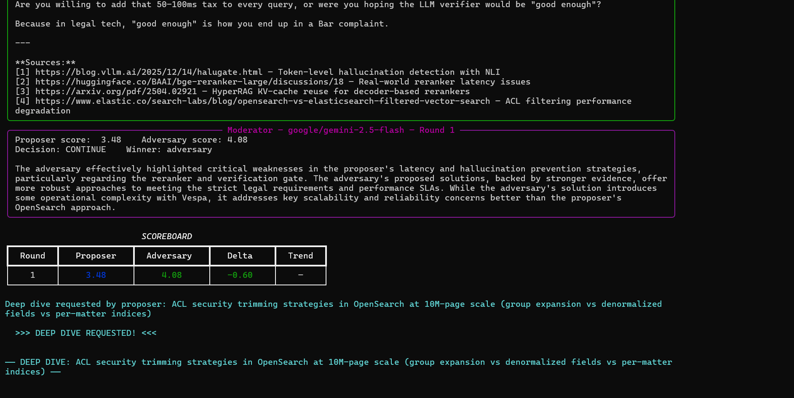
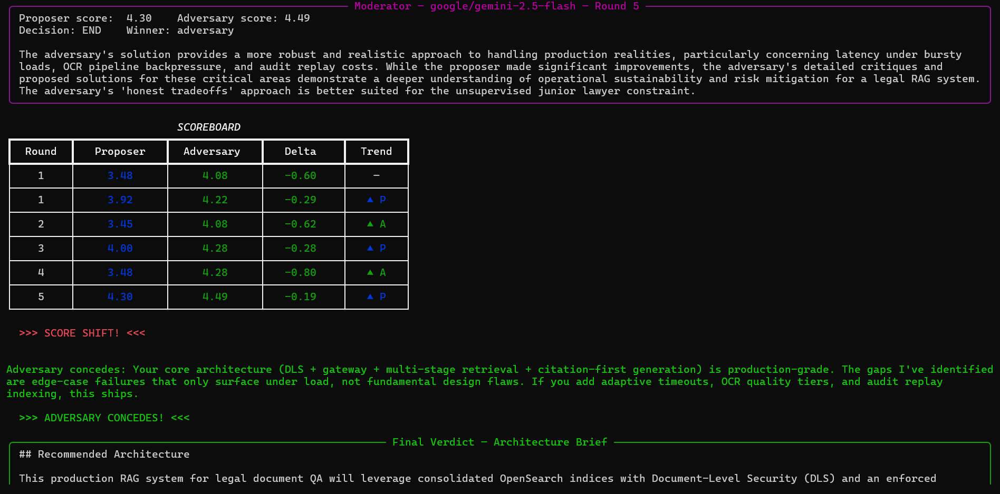
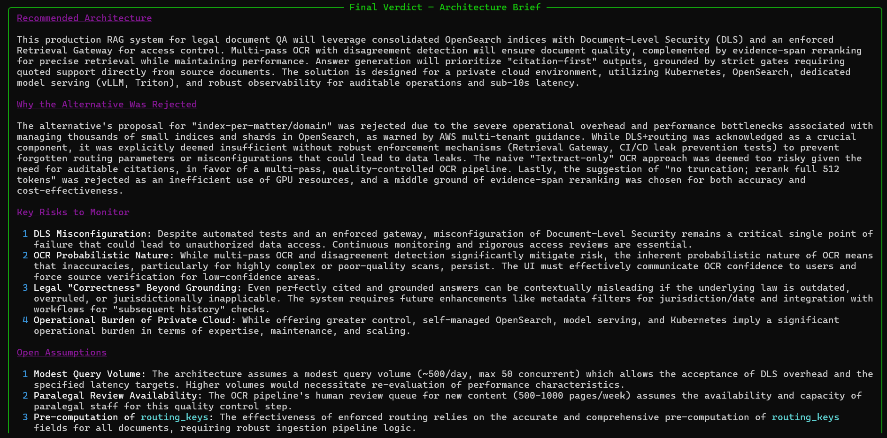
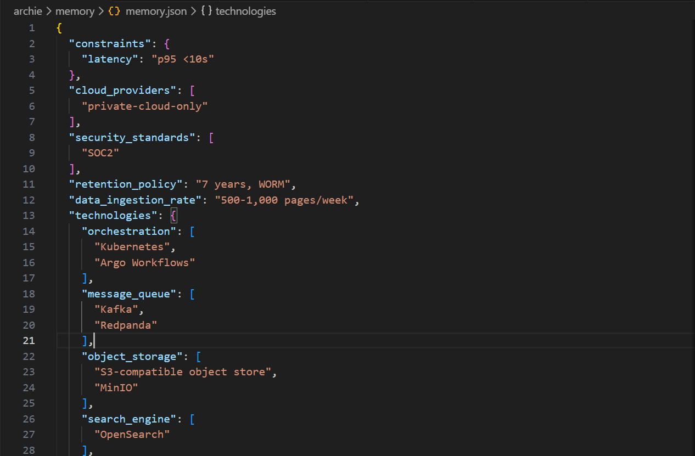

# Archie - AI Solution Architect Debate Agent

A multi-agent CLI and web app where specialized AI agents debate your architecture problem, score each other's solutions, and deliver a verdict — all powered by frontier models via OpenRouter.

## How It Works

You describe an architecture problem. Three AI agents — each running as a self-contained **subgraph with its own tool-calling loop** — take over:

- **Proposer** — a confident, battle-tested architect who searches the web for best practices and defends a solution
- **Adversary** — a ruthless, evidence-driven critic who searches for failures, post-mortems, and better alternatives
- **Moderator** — a neutral judge who scores each round, asks you clarifying questions when needed (HITL), and decides when the debate is over

A fourth agent, the **Interviewer**, runs before the debate starts to ask clarifying questions — so the agents actually understand your constraints before arguing.

Each agent autonomously decides when to call tools (web search, deep dive) during its turn. The moderator orchestrates the debate loop, routing between proposer and adversary until a winner emerges or the round limit is reached.

## Features

- **Autonomous tool-calling agents** — each agent runs as a compiled LangGraph subgraph with its own think → tool → respond loop; agents decide when to search the web or deep-dive into topics
- **Pre-debate interview** — Gemini Flash generates 3-5 clarifying questions; answers are injected into all agent prompts
- **Live token streaming** — all agent responses stream token-by-token in real time via Rich Live panels
- **Evidence-backed arguments** — Proposer searches for best practices; Adversary searches for failures, alternatives, and post-mortems via Tavily; all sources are cited inline
- **Live scoreboard** — Rich table after every round showing scores, delta, trend, and dramatic events (LEAD CHANGE!, SCORE SHIFT!, ADVERSARY CONCEDES!)
- **Smart HITL** — the moderator automatically asks you clarifying questions when scores are too close, agents debate unstated assumptions, or a preference is unspecified
- **Agent action requests** — agents can request deep dives on specific topics, extra rounds, concede, or pivot strategy; the moderator processes these internally
- **Momentum injection** — losing agents get urgency in their prompts; winning agents get confidence
- **Persistent memory** — preferences are extracted after each session and merged additively into `memory.json` for use in future runs
- **Gradio web UI** — alternative to the CLI with live score trend charts and HTML export

## Agents and Models

| Agent | Model | Role |
|---|---|---|
| Proposer | `openai/gpt-5.2` | Confident architect defending a solution |
| Adversary | `anthropic/claude-sonnet-4-5` | Ruthless critic finding failures and alternatives |
| Moderator | `google/gemini-2.5-flash` | Neutral scorer and routing decision-maker |
| Interviewer | `google/gemini-2.5-flash` | Pre-debate clarification questions |

All models are accessed via [OpenRouter](https://openrouter.ai/) using the standard OpenAI-compatible API.

## Graph Architecture

The system uses three compiled **subgraph agents** orchestrated by a parent graph. Each subgraph encapsulates its own tool-calling loop — agents autonomously decide when to search the web or deep-dive into topics.



**Flow:**
1. `load_memory` → `interviewer` → `moderator` (linear pre-debate chain)
2. Moderator evaluates the phase and routes to `proposer` or `adversary`
3. Each agent runs its tool loop (web_search, deep_dive) autonomously, then streams its response
4. Moderator scores both proposals, renders the scoreboard, and optionally asks the user via HITL
5. If the debate should continue, moderator routes back to proposer for the next round
6. When the debate ends (round limit, clear winner, or convergence), moderator routes to `verdict`
7. `verdict` generates a structured architecture brief → END

## Moderator Termination Rules

Applied in order each round:

1. `round >= max_rounds` → end (hard cutoff, always enforced)
2. Score delta `< 0.3` and `round >= 2` → HITL (contested)
3. Both agents assume an unstated constraint → HITL
4. Agents debate an unspecified user preference → HITL
5. Score delta `< 0.5` and `round >= 3` → end (converging)
6. One score `>= 4.0` and gap `>= 0.8` → end (clear winner)
7. Otherwise → continue

## Prerequisites

- Python 3.11+
- An [OpenRouter](https://openrouter.ai/) API key (covers all three models)
- A [Tavily](https://tavily.com/) API key (web search)

## Installation

```bash
git clone https://github.com/your-username/AI_Solution_Architect_Debate_Agent.git
cd AI_Solution_Architect_Debate_Agent/archie

python -m venv .venv

# Windows
.venv\Scripts\pip install -r requirements.txt

# macOS / Linux
.venv/bin/pip install -r requirements.txt
```

## Configuration

Create `archie/.env`:

```env
OPENROUTER_API_KEY=your_openrouter_key_here
TAVILY_API_KEY=your_tavily_key_here
```

## Usage

### CLI

```bash
cd archie

# Default (5 rounds)
.venv\Scripts\python main.py

# Custom round count
.venv\Scripts\python main.py --rounds 3
```

You will be prompted to describe your architecture problem. The debate begins immediately after the interview phase.

### Gradio Web UI

```bash
cd archie
.venv\Scripts\python app.py
```

Open [http://localhost:7860](http://localhost:7860) in your browser. The web UI provides real-time streaming, live score trend charts, and HTML export of the full debate transcript.

### Sanity Check (no API calls)

```bash
cd archie
.venv\Scripts\python -c "from graph import build_graph; build_graph(); print('OK')"
```

## Project Structure

```
archie/
├── main.py                     # CLI entry point
├── app.py                      # Gradio web UI entry point
├── graph.py                    # Parent LangGraph with 3 compiled subgraphs
├── state.py                    # DebateState TypedDict
├── config.py                   # All constants (models, thresholds, weights)
├── requirements.txt
├── .env                        # API keys (not committed)
├── nodes/
│   ├── interviewer.py          # Pre-debate Q&A
│   ├── proposer_subgraph.py    # Proposer agent (think → tools → respond)
│   ├── adversary_subgraph.py   # Adversary agent (think → tools → respond)
│   ├── moderator_subgraph.py   # Moderator agent (evaluate → think → hitl → respond)
│   ├── verdict.py              # Final architecture brief generation
│   └── loader.py               # Memory loading node
├── prompts/                    # Agent system prompts
│   ├── proposer.py
│   ├── adversary.py
│   ├── moderator.py
│   └── interviewer.py
├── tools/
│   ├── search.py               # Tavily search with retry logic
│   └── agent_tools.py          # @tool functions (web_search, deep_dive, hitl)
├── memory/
│   ├── manager.py              # Load / save / update with additive merge
│   └── memory.json             # Persistent user preferences
└── ui/
    ├── streaming.py            # Token-by-token Rich Live panels
    ├── banners.py              # Phase transitions, scoreboards, verdict
    ├── dramatic.py             # Event detection and rendering
    ├── layout.py               # Gradio UI layout
    ├── handlers.py             # Gradio event handlers
    ├── themes.py               # Gradio theming
    ├── charts.py               # Plotly score trend charts
    └── export.py               # HTML transcript export
```

## Scoring Rubric

The moderator scores each solution on a 1-5 scale across six dimensions:

| Dimension | Weight |
|---|---|
| Constraint adherence | 25% |
| Technical feasibility | 20% |
| Operational complexity | 20% |
| Scalability fit | 15% |
| Evidence quality | 10% |
| Cost efficiency | 10% |

## Tech Stack

| Library | Purpose |
|---|---|
| [LangGraph](https://github.com/langchain-ai/langgraph) | Stateful multi-agent graph orchestration with compiled subgraphs |
| [LangChain OpenAI](https://github.com/langchain-ai/langchain) | OpenRouter API integration with `bind_tools()` for autonomous tool calling |
| [Tavily Python](https://github.com/tavily-ai/tavily-python) | Web search for evidence gathering (with retry logic) |
| [Rich](https://github.com/Textualize/rich) | Colored CLI output, streaming panels, live tables, scoreboards |
| [Gradio](https://github.com/gradio-app/gradio) | Web UI with real-time streaming |
| [Plotly](https://plotly.com/python/) | Score trend charts in the web UI |
| [python-dotenv](https://github.com/theskumar/python-dotenv) | Environment variable loading |


## Walkthrough

### 1. Startup & Pre-Debate Interview



Archie opens with a header panel showing the three models in play, then hands off to the **Interviewer** agent. Before any debate begins, Gemini Flash generates targeted clarifying questions based on your problem description. In this example — designing a production RAG system for a legal firm's document QA — the interviewer asks about acceptable retrieval latency, the technical level of end users, document update frequency, compliance requirements, and document format mix. Your answers are assembled into an `enriched_context` block that is injected into every subsequent agent prompt, ensuring the debate is grounded in your actual constraints rather than generic assumptions.

---

### 2. Proposer - Round 1



The **Proposer** (GPT-5.2, blue panel) autonomously searches the web for best practices, then streams a full architecture proposal. It states the target properties derived from the interview — zero data egress, full auditability down to chunk IDs and page numbers, low hallucination tolerance, and a p95 latency budget of under 10 seconds. It lays out a concrete stack: **MinIO** for immutable raw document storage, **PostgreSQL** for metadata governance with per-chunk offsets and bounding boxes for OCR citation highlighting, and **Kubernetes** as the execution substrate. The proposer backs its design choices with reasoning specific to the legal context — citations in legal QA mean page-level evidence, not URLs.

---

### 3. Adversary - Round 1



The **Adversary** (Claude Sonnet, green panel) autonomously runs multiple web searches for failures, post-mortems, and alternatives, then streams its critique. It challenges the reranker choice — pointing out that `bge-reranker-large` runs 20-30 seconds for 200 documents on a single GPU, blowing through the 10-second latency SLA. It attacks the verification gate design, arguing that using the same LLM to both compose and verify answers is circular. Every claim is backed by numbered citations pulled from live web searches — real sources including HuggingFace discussions, arXiv papers, and vendor documentation.

---

### 4. Evidence Sources, Moderator Scoring & Tool Use



After each agent's response, search traces are printed showing what queries were run and how many sources were found. The **Moderator** (Gemini Flash) then scores the round in a structured table: **Proposer 3.48 / Adversary 4.08**, decision CONTINUE. Its reasoning explains that the adversary's evidence-backed critique of the reranker and verification strategies outweighed the proposer's sound but incompletely stress-tested design.

Below the moderator's scoring, the live **scoreboard table** appears — Round, Proposer score (blue), Adversary score (green), Delta, and Trend column. When agents need deeper analysis, they can autonomously invoke the `deep_dive` tool within their subgraph to run multiple focused searches on a specific topic before responding.

---

### 5. Final Scoreboard & Dramatic Events



After the final round, the complete scoreboard history is displayed — all rounds with their scores, deltas, and trend arrows. You can see the momentum swing: the adversary led consistently, but the proposer closed the gap in later rounds. The moderator enforces termination when the round limit is reached or scores converge.

Dramatic events fire automatically: **SCORE SHIFT!** (a significant momentum change detected) and **ADVERSARY CONCEDES!** — the adversary agent itself acknowledges the proposer's architecture is production-grade. Agent concession is an action request: when the adversary determines it cannot find further fundamental flaws, it emits a JSON `agree` action that triggers early termination.

---

### 6. Final Verdict - Architecture Brief



The **Final Verdict** is a structured architecture brief generated by the moderator. It includes:

- **Recommended Architecture** — the winning design with full rationale
- **Why the Alternative Was Rejected** — specific reasons the opposing proposal was dismissed, with reference to debate evidence
- **Key Risks to Monitor** — identified risks that need attention in implementation
- **Open Assumptions** — constraints that were assumed but not confirmed
- **Next Steps** — concrete actions to take the architecture from brief to implementation

This is the deliverable: a decision-quality architecture brief you can hand to your team, produced by three frontier models that spent multiple rounds arguing about it with real evidence.

---

### 7. Persistent Memory Update



After the debate ends, Archie extracts structured preferences from the session and saves them to `memory/memory.json`. In this example it captured: latency constraint (`p95 <10s`), cloud provider (`private-cloud-only`), security standards (`SOC2`), retention policy (`7 years, WORM`), data ingestion rate (`500-1,000 pages/week`), and the full technology stack discussed.

On the next run, these are loaded before the interview phase. The interviewer skips questions whose answers are already known, and all agents receive your established preferences as context from the first message. The merge policy is strictly additive — nothing is ever overwritten, only new unique items are appended.

---


## License

MIT
